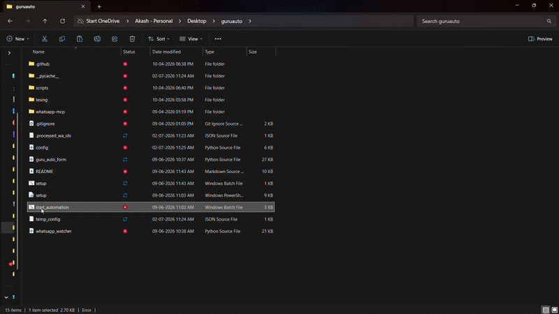

# 🎓 GuruPadigm-MCP-AutoFill

> **Send a PPTX on WhatsApp. Walk away. The form is submitted in under 30 seconds.**

GuruPadigm-MCP-AutoFill is a Windows automation pipeline that watches for incoming **PPTX files on WhatsApp**, extracts student data, converts the file to PDF, and **auto-fills & submits a Google Form** — completely hands-free.

Built with **Python · Playwright · WhatsApp MCP · Go**

---

## 🎬 Workflow Demo



> **Note:** In this demo recording, `AUTO_SUBMIT` was set to **`False`** and `HEADLESS` was set to **`False`** — so the browser window is fully visible and the form is **not actually submitted**. In production use, set both to `True` for fully hands-free, background operation.

---

## ⚡ Quick Start (Recommended)

> **This is the only command most users need.**

1. Complete the [one-time automated setup](#️-one-time-setup-automated) below.
2. Double-click **`start_automation.bat`** from the project root.

That's it. The script will:

| Step | What happens |
|------|-------------|
| 🔴 | Closes any open Chrome windows (frees the Chrome profile lock) |
| 🟡 | Verifies Go is installed (only if running from source) |
| 🟢 | Starts the **Go WhatsApp bridge** using the pre-compiled binary (`whatsapp-bridge.exe`) |
| ⏳ | Waits 10 seconds for the bridge to initialize |
| 🟢 | Starts the **Python PPTX watcher** in a new terminal window |

Once running, **send a PPTX from a whitelisted WhatsApp number** and the form fills itself.

```
📱 WhatsApp  ──►  🌉 Go Bridge  ──►  🐍 Python Watcher  ──►  🌐 Playwright  ──►  ✅ Form Submitted
```

---

## ✨ How It Works

```
Mentor sends PPTX on WhatsApp
        │
        ▼
Go Bridge  (whatsapp-mcp/whatsapp-bridge)
  ↓ detects new PPTX document in WhatsApp
  ↓ POSTs instantly to localhost:9999
        │
        ▼
whatsapp_watcher.py
  ↓ validates sender is in ALLOWED_SENDERS whitelist
  ↓ downloads PPTX via bridge REST API
  ↓ writes temp_config.json
        │
        ▼
guru_auto_form.py  (Playwright)
  ↓ launches Chrome with a dedicated profile
  ↓ converts PPTX → PDF  (via MS Office COM / LibreOffice)
  ↓ fills all Google Form fields
  ↓ uploads PDF attachment
  ↓ submits the form
        │
        ▼
WhatsApp confirmation message sent back ✅
```

> **Fallback:** If the instant push is missed, the watcher also polls the SQLite database every 5 minutes as a safety net.

---

## 📁 Project Structure

```
guruauto/
├── 🚀 start_automation.bat        ← START HERE — launches everything
├── 🛠️ setup.ps1                   ← RUN FIRST — installs all runtimes & compiles binaries
│
├── ⚙️ config.py                    ← EDIT THIS — all your settings in one place
├── guru_auto_form.py              # Core Playwright form-filler
├── whatsapp_watcher.py            # WhatsApp PPTX watcher + event server
│
├── whatsapp-mcp/
│   └── whatsapp-bridge/           # Go WebSocket bridge for WhatsApp Web
│       └── store/
│           └── messages.db        # SQLite message store (auto-created on first run)
│
├── temp_config.json               # Auto-generated per-run config (git-ignored)
└── .processed_wa_ids.json         # Dedup tracker — prevents double submissions (git-ignored)
```

---

## 🛠️ One-Time Setup (Automated)

> **This is the easiest setup method. It installs all runtimes, configures path variables, downloads browsers, and pre-compiles binaries automatically.**

### Step 1 — Clone the repo

```bash
git clone https://github.com/AkashKrish1010/GuruPadigm-MCP-AutoFill.git
cd GuruPadigm-MCP-AutoFill
```

---

### Step 2 — Run the Automated Installer

1. Double-click **`setup.bat`** in the project root folder.
2. Accept the **Administrator prompt** (which will automatically elevate the PowerShell script) to allow installations and system variable path updates.
4. The script will automatically run checks and install:
   - **Python 3.12** (if missing)
   - **Go SDK 1.21+** (if missing)
   - **MSYS2 & GCC compiler** (if missing)
   - All Python libraries (`playwright`, `flask`, `requests`, `comtypes`)
   - Playwright Chromium browser components
   - Adds MSYS2/GCC & Go paths to your system environment variables
   - Pre-compiles the Go bridge code into a standalone binary: `whatsapp-bridge.exe`

---

### Step 3 — Configure your settings ⭐
Open **`config.py`** and fill in your details. This is the **only file you need to edit.**

```python
# 1. Allowed WhatsApp senders (country code + number, no '+')
ALLOWED_SENDERS = [
    "919876543210",        # Example: +91 98765 43210
]

# 2. Google Form link
FORM_LINK = "https://forms.gle/YOUR_FORM_LINK"

# 3. Form field defaults
DEFAULT_MENTEE_NAME     = "Your Name"
DEFAULT_REGISTER_NUMBER = "XXXXXXXXX"
DEFAULT_MENTOR_NAME     = "Dr. Mentor Name"
DEFAULT_DEPARTMENT      = "Your Department Name"
```

---

### Step 4 — Google Account Login Setup & Session Recovery

The automation uses a dedicated Chrome profile directory (`C:\PlaywrightProfiles\GuruProfile`) to persist your Google Account session.

#### Initial Setup
The first time you start the watcher, it will detect if the profile is missing and **automatically launch a login setup window**.

Alternatively, you can run the login setup manually at any time:
```bash
python guru_auto_form.py --login
```
1. A real, non-automated Google Chrome window will open.
2. Sign in to the Google Account used to submit the Google Form.
3. Close the Chrome browser window and press **Enter** in the console.

#### Automatic Runtime Recovery
If your Google login session expires or gets logged out mid-run, the script will gracefully:
1. Temporarily pause automation and close the automated browser.
2. Open a real Chrome window prompting you to sign back in.
3. Once you sign in and press Enter in the terminal, it will automatically resume the form execution and submit it.

---

### Step 5 — First run & QR code scan

1. Double-click **`start_automation.bat`**.
2. In the **WhatsApp Bridge** window that opens, a **QR code** will appear.
3. On your phone, open WhatsApp → **Linked Devices → Link a Device** → scan the QR code.
4. The bridge will say `Connected`. The watcher window will start polling.

> You only need to scan the QR code once. The session is saved in `whatsapp-mcp/whatsapp-bridge/store/`.

---

## 🛠️ Manual Installation (Advanced)

If you prefer to install packages manually instead of using `setup.ps1`:

### Prerequisites
Ensure Windows 10/11 is installed, along with Google Chrome, Python 3.10+, and Go 1.21+.

### Step 1 — Clone the repo
```bash
git clone https://github.com/AkashKrish1010/GuruPadigm-MCP-AutoFill.git
cd GuruPadigm-MCP-AutoFill
```

### Step 2 — Install Python dependencies & Playwright
```bash
pip install playwright requests flask flask-cors comtypes
playwright install chromium
```

### Step 3 — Install MSYS2 (C Compiler for Go SQLite driver)
1. Download and install MSYS2 from **[msys2.org](https://www.msys2.org/)**.
2. Open the **MSYS2 UCRT64** shell and run:
   ```bash
   pacman -S mingw-w64-ucrt-x86_64-gcc
   ```
3. Add `C:\msys64\ucrt64\bin` to your **Windows PATH** environment variable.
4. Verify by running `gcc --version` in a new CMD terminal.

### Step 4 — Compile Go WhatsApp Bridge
```bat
cd whatsapp-mcp\whatsapp-bridge
go env -w CGO_ENABLED=1
go mod tidy
go build -o whatsapp-bridge.exe main.go
```

---

## 🚀 Running the Automation

### ✅ Option A — One-click (recommended)
Double-click **`start_automation.bat`**.
Two terminal windows will open — leave them running. Close them to stop the automation.

---

### Option B — Manual (two terminals)

**Terminal 1 — Go bridge:**
```bat
cd whatsapp-mcp\whatsapp-bridge
# Run the pre-compiled binary
whatsapp-bridge.exe
```

**Terminal 2 — Python watcher:**
```bash
python whatsapp_watcher.py
```

---

## 🧪 Testing Without WhatsApp

Run `guru_auto_form.py` directly to test form-filling with the defaults from `config.py`:

```bash
python guru_auto_form.py
```

---

## 🔒 Security Notes

- **`config.py`** contains YOUR personal settings — **review it before committing.** The repo ships with placeholder values only.
- **`temp_config.json`** and **`.processed_wa_ids.json`** are in `.gitignore` — they contain personal data and must never be committed.
- The `ALLOWED_SENDERS` whitelist ensures only trusted contacts can trigger form submissions.
- The Playwright Chrome profile (set via `CHROME_PROFILE_DIR` in `config.py`) stores your Google session cookies — **do not share this folder**.

---

## ❗ Common Issues

| Problem | Fix |
|---|---|
| `messages.db not found` | Start the Go bridge first — the DB is created after the first WhatsApp connection. |
| `Binary was compiled with 'CGO_ENABLED=0', go-sqlite3 requires cgo` | `gcc` is not in your PATH. Run `setup.ps1` to configure GCC compile settings automatically. |
| `Chrome profile session expired` | Run `python guru_auto_form.py --login` to re-login, or wait for the automatic runtime setup prompt. |
| `PPTX → PDF conversion failed` | Ensure Microsoft Office or LibreOffice is installed. |
| `Bridge not reachable` | Make sure the Go bridge is running at `http://localhost:8080`. |
| Form submits to wrong department | Update `DEFAULT_DEPARTMENT` in `config.py` to exactly match the dropdown text. |
| PPTX triggers form twice | Check `.processed_wa_ids.json` — the dedup tracker prevents this; if corrupted, delete it. |

---

## 🤝 Contributing

Pull requests are welcome! For major changes, please open an issue first.

1. Fork the repository
2. Create your branch: `git checkout -b feature/my-feature`
3. Commit changes: `git commit -m 'Add my feature'`
4. Push: `git push origin feature/my-feature`
5. Open a Pull Request

---

## 📄 License

This project is open-source under the [MIT License](LICENSE).

---

## 👤 Author

**Akash S** — built to automate the weekly Gurupadigam mentoring form at college, cutting submission time from ~10 minutes to under 30 seconds (30× speedup).

> *"Automate the boring stuff so you can focus on what matters."*

---

## 🙏 Acknowledgments

- **[whatsapp-mcp](https://github.com/lharries/whatsapp-mcp)** by [lharries](https://github.com/lharries) — the Go-based WhatsApp Web bridge that powers the messaging layer of this project.
